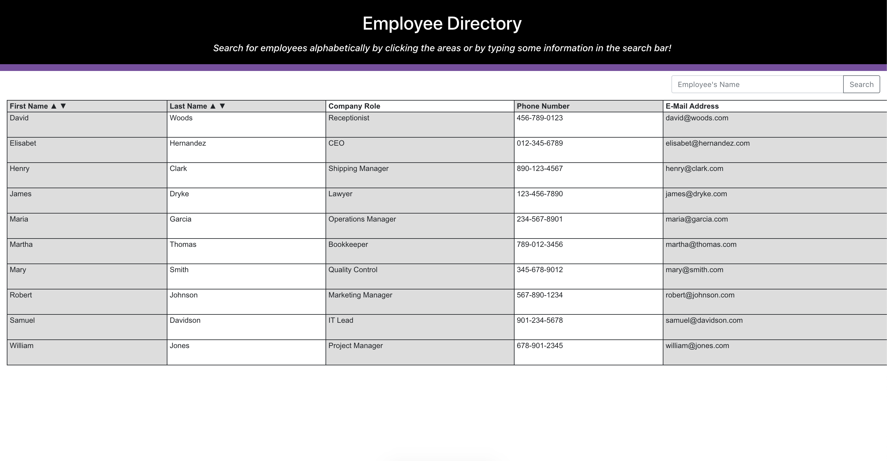
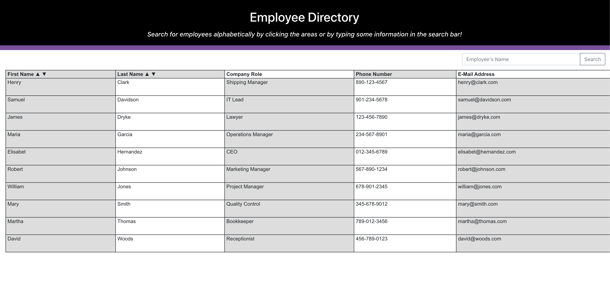

# Employee Directory

## Table of Contents
* [Description](#description)
* [Installation](#installation)
* [Technologies Used](#technologies-used)
* [Application Demo](#application-demo)
* [Contact Information](#contact-information)

## Description
This application will allow users to view an entire employee directory at once so that managers and/or other employees can have quick access to non-sensitive information and data about other employees. Users may also filter these results by name.

## Installation
This application is deployed on [GitHub Pages](https://jtbataille.github.io/Employee-Directory/) for users to poke around and see how it functions.

## Technologies Used
React, JSX, Node JS, HTML, CSS, JavaScript

## Application Demo
After following the information in the [Installation](#installation) section above users will be greated with an opening page that looks like this:

Users are also able to use the up or down arrows on the **"First Name"** or **"Last Name"** columns to alphabetize their employee's name if they desire

In addition to being deployed on Heroku, here is a GIF showing the app's full functionality:

## Contact Information
* Jarrod Bataille
  * Portfolio Webpage: https://jtbataille.github.io/
  * GitHub Profile: https://github.com/jtbataille
  * E-mail Address: jtbataille@gmail.com